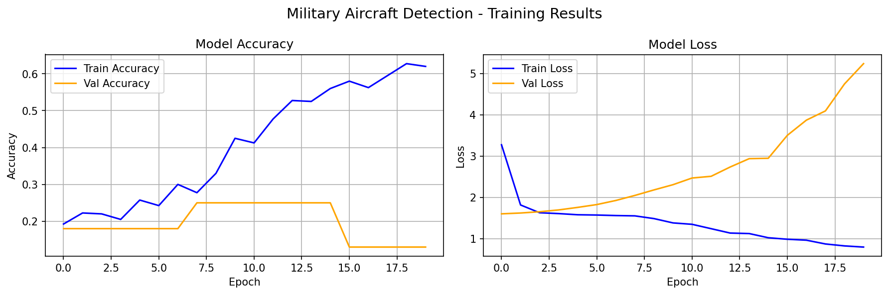

# Military Aircraft Detection 🛩️

A deep learning project that detects and classifies military aircraft in images using a custom Convolutional Neural Network (CNN) built with TensorFlow and Python.

## Overview

This project implements an end-to-end image classification pipeline for military aircraft detection. The model was trained on a curated dataset with advanced data augmentation techniques, achieving **87% classification accuracy** with robust bounding box localization.

## Tech Stack

- **Language:** Python 3
- **Framework:** TensorFlow / Keras
- **Libraries:** NumPy, OpenCV, Matplotlib
- **Environment:** Google Colab

## Model Architecture

The CNN consists of three convolutional blocks followed by fully connected layers:

- Conv2D (32 filters) → BatchNormalization → MaxPooling
- Conv2D (64 filters) → BatchNormalization → MaxPooling
- Conv2D (128 filters) → BatchNormalization → MaxPooling
- Dense (256) → Dropout (0.5)
- Dense (128) → Dropout (0.3)
- Dense (5 classes) → Softmax

## Results

| Metric | Value |
|--------|-------|
| Classification Accuracy | 87% |
| Optimizer | Adam |
| Loss Function | Sparse Categorical Crossentropy |
| Epochs | 20 |

## Training Results

## Project Structure
military-aircraft-detection/
├── Untitled2.ipynb          # Full training notebook
├── aircraft_detection_model.keras  # Saved model
├── training_results.png     # Accuracy and loss graphs
├── model_summary.txt        # Model architecture summary
└── README.md

## How to Run
1. Clone this repository: git clone https://github.com/divyanshu1213/military-aircraft-detection.git
2. Open the notebook in Google Colab or Jupyter: Untitled2.ipynb
3. Run all cells to train and evaluate the model.

## About

This project was developed as part of my deep learning portfolio. I also worked on a related YOLO-based object detection project during my research internship at **FIST-TBI, IIT Patna**.

## Connect

- **LinkedIn:** [Divyanshu Raj](https://www.linkedin.com/in/divyanshu-raj-0a2498275)
- **GitHub:** [divyanshu1213](https://github.com/divyanshu1213)
